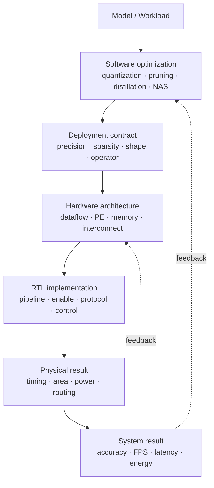

# AI Hardware Optimization Survey

## 목적

이 문서는 AI hardware 분야의 모든 논문을 나열하는 systematic review가 아니라, model optimization과 accelerator optimization을 **같은 trade-off 언어로 연결하기 위한 engineering map**입니다.

핵심 질문은 “어떤 기법이 유명한가?”가 아니라 다음 세 가지입니다.

1. Software graph 또는 numeric representation에서 무엇이 바뀌는가?
2. Hardware가 그 변화를 실제 cycle, memory transaction 또는 switching 감소로 바꿀 수 있는가?
3. Accuracy, latency, throughput, energy와 area 중 어떤 지표로 검증해야 하는가?

## Survey structure

- [Software and Algorithm Optimization](SOFTWARE_OPTIMIZATION.md)
- [Hardware Architecture Optimization](HARDWARE_OPTIMIZATION.md)
- [Software–Hardware Co-design](SW_HW_CODESIGN.md)
- [Optimization Trade-off Matrix](OPTIMIZATION_TRADEOFF_MATRIX.md)

## Whole-stack view

## 핵심 원칙

- FLOPs나 parameter 수 감소가 자동으로 latency 또는 energy 감소를 뜻하지 않습니다.
- Unstructured sparsity는 decoder, metadata와 load balancing을 지원하는 hardware가 없으면 이득을 잃을 수 있습니다.
- 낮은 bit width는 arithmetic, storage와 bandwidth를 줄일 수 있지만 scale 처리와 accuracy recovery 비용을 함께 봐야 합니다.
- Memory data movement는 중요한 비용이지만 static/background/clock 및 control overhead를 제외한 수치만으로 total energy를 주장해서는 안 됩니다.
- Pre-route 추정은 후보 선택에 유용하지만 최종 주장은 post-route activity와 실제 system measurement로 확인해야 합니다.

## Representative primary references

- Jacob et al., [Integer-arithmetic-only quantization and training](https://openaccess.thecvf.com/content_cvpr_2018/html/Jacob_Quantization_and_Training_CVPR_2018_paper.html), CVPR 2018
- Han et al., [Deep Compression](https://arxiv.org/abs/1510.00149), 2015
- Wang et al., [HAQ: Hardware-Aware Automated Quantization](https://openaccess.thecvf.com/content_CVPR_2019/html/Wang_HAQ_Hardware-Aware_Automated_Quantization_With_Mixed_Precision_CVPR_2019_paper.html), CVPR 2019
- Chen et al., [Eyeriss v2](https://people.csail.mit.edu/emer/media/papers/2019.04.jetcas.eyeriss_v2.pdf), JETCAS 2019
- Parashar et al., [SCNN](https://research.nvidia.com/publication/2017-06_scnn-accelerator-compressed-sparse-convolutional-neural-networks), ISCA 2017
- Parashar et al., [Timeloop](https://research.nvidia.com/publication/2019-03_timeloop-systematic-approach-dnn-accelerator-evaluation), ISPASS 2019

각 수치는 해당 논문의 workload, technology와 baseline에 종속됩니다. 이 저장소는 논문 수치를 현재 FPGA 결과에 직접 대입하지 않습니다.
