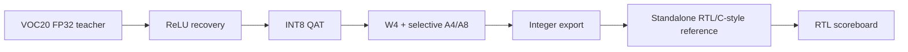

# Mixed-Precision YOLOv5s RTL FPGA Accelerator

> From quantized software reference to bit-exact RTL verification, AXI integration, and ZCU104 physical implementation.

[← Portfolio home](../README.md) · [AI Hardware Survey](../01_AI_HARDWARE_SURVEY/README.md)

이 저장소는 YOLOv5s 기반 객체검출 가속기를 SystemVerilog RTL로 구현하면서 수행한 설계·검증·SoC 통합 과정을 정리한 공개 기술 포트폴리오입니다. 논문 투고 전 지식재산을 보호하기 위해 전체 RTL과 세부 architecture는 공개하지 않으며, 재현 가능한 검증 방법과 engineering evidence를 중심으로 설명합니다.

## Project at a glance

| 항목 | 내용 |
|---|---|
| Workload | YOLOv5s, 640×640 input, VOC20 target |
| Numeric format | W4와 선택적 A4/A8 mixed precision, RTL bit-width/rounding/saturation contract |
| Hardware | Parameterized SystemVerilog accelerator |
| Verification | PyTorch integer reference → layer golden → RTL scoreboard |
| SoC interface | AXI4-Lite control, AXI4-Stream input/output, AXI DMA |
| FPGA target | AMD-Xilinx ZCU104 |
| Clock target | 구현 후보별 190–200 MHz, 결과에는 적용 clock를 별도 표기 |
| Current status | RTL/AXI 검증, ZCU104 PYNQ 객체검출 데모 구현, legal-route baseline 확보; 최종 timing/public board benchmark는 별도 sign-off |

## Why this project?

YOLOv5s는 convolution만 반복하는 단순 workload가 아닙니다. 서로 다른 feature-map 크기와 channel 수, residual connection, concatenation, upsampling, SPPF, multi-scale detection head가 하나의 graph를 구성합니다. 따라서 RTL 구현에서는 연산기뿐 아니라 memory lifetime, producer-consumer dependency, parameter delivery, backpressure, completion timing을 함께 다뤄야 합니다.

이 프로젝트는 모델 구조를 과도하게 단순화해 구현 난도를 피하기보다, 검증된 모델의 주요 연산 흐름을 유지하고 발생하는 문제를 hardware architecture와 scheduling으로 해결하는 것을 목표로 했습니다.

이 선택은 단순한 구현 편의가 아니라 **기여의 원인을 분리하기 위한 실험 원칙**입니다. Backbone·neck·multi-scale detection의 주요 graph를 유지하면, channel 축소나 layer 제거에서 얻은 성능·자원 이득을 RTL architecture의 효과로 오인하지 않게 됩니다. 반면 dataset class, activation과 quantization 규칙은 VOC20 응용과 RTL 정수 연산 계약에 맞게 명시적으로 변경했습니다. 따라서 이 결과물은 “공식 checkpoint를 그대로 실행한 것”이 아니라 **YOLOv5s-derived VOC20 low-precision RTL accelerator**로 표현합니다.

설계의 차별점은 특정 convolution 블록 하나가 아니라 다음의 연결에 있습니다.

- 복잡한 graph의 compute·data-supply·control 병목을 함께 분석
- 단일 layer를 넘어 인접 producer-consumer/branch 구간을 scheduling 범위로 사용
- 별도 연산기를 계속 추가하지 않고 고정 compute fabric의 역할과 data path를 구간별로 전환
- feature/weight 이동, parameter prefetch와 completion timing을 연산 schedule과 함께 설계
- 전체 network의 integer golden부터 AXI와 physical implementation까지 동일한 acceptance chain으로 검증

이 설계 선택의 정당성과 현재 주장 가능한 범위는 [Model Preservation and Hardware Contribution](docs/01_MODEL_PRESERVATION_AND_HARDWARE_CONTRIBUTION.md)에 정리했습니다.

## Why RTL?

RTL은 저절로 빠르거나 신뢰성이 높은 것이 아닙니다. 대신 병렬도, pipeline stage, memory access, fixed-point arithmetic, handshake와 완료 시점을 cycle 단위로 명시할 수 있습니다. 이 자유도를 올바른 검증과 physical sign-off에 연결하면 다음 특성을 확보할 수 있습니다.

- workload에 맞춘 deterministic datapath와 latency
- 연산·메모리·parameter prefetch의 중첩
- 불필요한 데이터 이동과 toggle의 제어
- backpressure 상황에서도 유지되는 protocol correctness
- software reference부터 FPGA implementation까지 추적 가능한 검증 근거

## Software-to-RTL pipeline

이 프로젝트의 software stage는 단순히 quantized checkpoint를 만드는 단계가 아니라, **RTL이 따라야 할 numeric contract와 golden reference를 생성하는 단계**입니다.

주요 software checkpoint는 `test2007`에서 FP32 teacher 62.18%, ReLU recovery 60.50%, INT8 QAT 59.89%, final W4 + selective A4/A8 55.94% mAP@0.5:0.95를 기록했습니다.

최종 software-to-integer comparison은 동일한 fixed 640×640 loader에서 다시 수행했습니다. Quantized software reference는 mAP@0.5:0.95 55.84%, source YOLO/Brevitas object 없이 exported integer artifact만으로 실행되는 standalone RTL/C-style reference는 55.40%로, 차이는 **-0.439%p**였습니다.

학습·quantization·distillation·integer export와 검증 기준은 [Software-to-RTL Pipeline](software/README.md)에 정리했습니다.

## Public system boundary

세부 NPU architecture는 공개하지 않고 외부 interface와 검증 경계만 설명합니다.

  

실제 ZCU104 Vivado Block Design. AXI/PS–PL integration은 tool evidence를 사용하고, NPU 내부 microarchitecture는 공개하지 않습니다.

## Board demo evidence

  

ZCU104 PYNQ 기반 object-detection demo. 실제 board와 monitor의 detection overlay를 함께 보여줍니다.

PYNQ demo 구현과 PS/PL integration 범위는 [ZCU104 AXI DMA Integration](docs/05_ZCU104_DMA_INTEGRATION.md)에 정리했습니다. Demo가 구현되었다는 사실과 public board FPS benchmark는 분리하며, matching `.bit`/`.hwh`와 measurement log가 공개되지 않은 상태에서는 numeric continuous-video FPS를 공개 benchmark로 사용하지 않습니다.

## Three reading paths

### 30 seconds — What was built?

저정밀 YOLOv5s를 대상으로 software reference, parameterized RTL, full-layer scoreboard, AXI VIP stress, ZCU104 DMA integration과 physical implementation을 하나의 검증 흐름으로 연결했습니다.

### 3 minutes — Is there evidence?

[Verification Strategy](docs/03_VERIFICATION_STRATEGY.md)에서 golden chain과 mismatch 기준을, [AXI VIP Verification](docs/04_AXI_VIP_VERIFICATION.md)에서 input gap·backpressure·packet 검증을, [Physical Design Debugging](docs/06_PHYSICAL_DESIGN_DEBUGGING.md)에서 route/timing 문제를 확인할 수 있습니다.

### Deep dive — Does the author understand the details?

[Engineering Notes](engineering_notes/README.md)는 AXI handshake, DMA, BRAM/URAM, OOC synthesis, incremental DCP와 congestion 분석을 실제 설계에서 얻은 원칙 중심으로 정리합니다.

## Verification evidence

- QAT 모델과 RTL의 bit-width, rounding, saturation 규칙을 명시적으로 연결
- VOC 입력 10종으로 full-layer regression 수행
- 이미지당 세 detection head의 raw output 100,800개 비교에서 mismatch 0 확인
- AXI 출력 33,600 beat에 대해 data, `TVALID`, `TREADY`, `TKEEP`, `TLAST` 검사
- input gap 3,729 cycle과 output backpressure 18,200 cycle을 포함한 stress test
- layer별 expected/actual count와 PASS/FAIL을 자동 집계하는 scoreboard 구성

## Quantitative snapshot

| Category | Result | Interpretation |
|---|---:|---|
| Selective mixed precision | 내부 activation 일괄 A4 baseline 대비 mAP@0.5:0.95 +0.46%p | 동일 W4 조건의 software ablation |
| RTL numeric model | mAP@0.5 79.79%, mAP@0.5:0.95 55.40% | VOC2007 test |
| PE utilization | 90.8% | 전체 추론 RTL cycle schedule 기준 |
| ZCU104 resources | LUT 157.3K, FF 170.3K, BRAM 244, URAM 64, DSP 1,152 | 구현 보고서 기준 |

Cycle model, Vivado estimate와 실제 board measurement는 서로 구분한다. ZCU104 PYNQ object-detection demo는 구현되어 있지만, matching bitstream/HWH와 measurement log를 public repository에 포함하지 않으므로 numeric continuous-video FPS는 별도 benchmark로 공개하지 않는다.

자세한 내용은 [Verification Strategy](docs/03_VERIFICATION_STRATEGY.md)와 [AXI VIP Verification](docs/04_AXI_VIP_VERIFICATION.md)을 참고하십시오.

## Engineering case study: timing closure

Core 단계의 기능과 구현 가능성을 확인한 뒤 ZCU104 full AXI/DMA system으로 확장하자 물리적 배치·배선 조건이 달라졌습니다. Full design에서는 routing은 성공했지만 WNS가 −0.262 ns인 기준점을 확보했습니다. 이는 timing pass가 아니라, 최악 경로를 재현할 수 있는 **legal-route physical baseline**입니다.

최악 경로는 32-bit ARM configuration 검사와 나머지 연산이 넓은 output packer의 clock-enable까지 연결된 routing-dominated control path였습니다.

전체 architecture를 무작정 변경하지 않고 다음 순서로 접근했습니다.

1. Routing 성공 post-route DCP와 source hash 보존
2. Worst path의 logic/routing delay와 fanout 분석
3. ARM qualification을 AXI-Lite 경계에서 1-bit pulse로 등록
4. Frame별 expected output count를 ARM 시 snapshot
5. Module-reference OOC netlist가 실제로 재생성됐는지 cell 단위 확인
6. 초기 `RuntimeOptimized` 설정의 목적 불일치를 공식 문서로 확인하고, 다음 closure 후보를 `TimingClosure`로 선정
7. 실제 5.000 ns clock을 유지하면서 선택한 wrapper 경로에만 4.800 ns guard 적용
8. Nominal 200 MHz와 추가 0.200 ns margin을 분리해 sign-off

Incremental DCP는 hard lock이나 성공 보장이 아니며, 0.200 ns guard도 AXI 규격이 아니라 프로젝트별 engineering margin입니다. `TimingClosure` 구성의 최종 구현 결과는 아직 나오지 않았으므로 timing이 확정되기 전에는 성공 수치로 표시하지 않습니다. 자세한 내용은 [Physical Design Debugging](docs/06_PHYSICAL_DESIGN_DEBUGGING.md)과 [Selective Wrapper Timing Guardband](engineering_notes/009_SELECTIVE_WRAPPER_TIMING_GUARDBAND.md)에 기록합니다.

## Documentation

- [Introduction](docs/00_INTRODUCTION.md)
- [Project Scope](docs/01_PROJECT_SCOPE.md)
- [Model Preservation and Hardware Contribution](docs/01_MODEL_PRESERVATION_AND_HARDWARE_CONTRIBUTION.md)
- [Software–RTL Numeric Contract](docs/02_SW_RTL_NUMERIC_CONTRACT.md)
- [Verification Strategy](docs/03_VERIFICATION_STRATEGY.md)
- [AXI VIP Verification](docs/04_AXI_VIP_VERIFICATION.md)
- [ZCU104 AXI DMA Integration](docs/05_ZCU104_DMA_INTEGRATION.md)
- [Physical Design Debugging](docs/06_PHYSICAL_DESIGN_DEBUGGING.md)
- [Results and Limitations](docs/07_RESULTS_AND_LIMITATIONS.md)
- [Real-Time Edge System Relevance](docs/08_REALTIME_EDGE_SYSTEM_RELEVANCE.md)
- [Engineering Notes](engineering_notes/README.md)
- [Disclosure Policy](../DISCLOSURE_POLICY.md)

## Repository scope

이 저장소는 portfolio case study입니다. 전체 RTL, trained weights, parameter payload, golden vector, Vivado generated products와 논문용 상세 architecture는 포함하지 않습니다. 공개 자료의 재사용 조건은 [LICENSE](../LICENSE.md), 공개 범위는 [Disclosure Policy](../DISCLOSURE_POLICY.md)를 확인하십시오.

