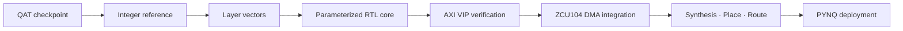

# Project Scope

## In scope

이 프로젝트는 software 학습 결과를 받아 FPGA에서 실행 가능한 accelerator system으로 연결하는 과정을 다룹니다.

담당 범위는 다음과 같습니다.

- RTL-friendly quantization contract 정의 및 parameter export 검증
- SystemVerilog datapath, memory controller와 global schedule 설계
- Full-network bit-exact scoreboard와 regression 구성
- AXI4-Lite/AXI4-Stream wrapper 및 protocol stress verification
- AXI DMA, FIFO, PS와 custom NPU의 SoC integration
- ZCU104 synthesis, routing, timing 및 resource 분석

## Design principles

- 기능 변경과 PPA 최적화를 분리해 검증
- 평균 throughput보다 end-to-end schedule과 idle cycle을 관찰
- 파형 육안 확인을 automated count/mismatch 검사로 보완
- 한 지표만 개선되는 변경은 채택하지 않음
- 완료되지 않은 board result나 power result는 수치로 주장하지 않음

## Out of public scope

본 저장소는 논문 재현용 source release가 아닙니다. 내부 PE 구조, layer별 schedule, memory banking, 전체 RTL과 trained artifact는 비공개입니다. 공개 목적은 구현의 소유권을 이전하는 것이 아니라 engineering process와 검증 역량을 제시하는 것입니다.

