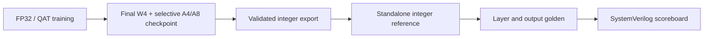

# Software–RTL Numeric Contract

## Why a numeric contract is required

Floating-point PyTorch output과 RTL output을 직접 비교하면 quantization, scale conversion, rounding, saturation과 packing 차이가 한꺼번에 섞입니다.  
이 상태에서는 mismatch가 model conversion 문제인지 RTL 구현 문제인지 분리하기 어렵습니다.

따라서 이 프로젝트의 RTL reference는 floating model이 아니라 **RTL 규칙을 실행하는 standalone integer model**입니다.

[Software pipeline →](../software/README.md)

## Reference chain

## Public numeric contract

| Boundary | Contract question |
|---|---|
| Weight | quantized integer weight가 QAT weight를 허용 오차 안에서 재구성하는가? |
| Activation | intended A4/A8 policy가 실제 graph에 반영되었는가? |
| Signedness | integer range와 sign extension이 software/RTL에서 동일한가? |
| Scale | QAT scale이 integer-domain parameter로 일관되게 변환되는가? |
| Accumulation | MAC accumulation order와 integer range가 reference와 일치하는가? |
| Rounding | shift/rounding 순서가 동일한가? |
| Saturation | overflow가 목표 integer range로 clamp되는가? |
| Residual | 두 branch의 scale domain을 맞춘 뒤 add하는가? |
| Concat / SPPF | multi-source activation의 scale source와 channel ordering이 일치하는가? |
| Detection | PL integer boundary와 PS dequant/decode 경계가 일치하는가? |
| Packing | byte/nibble/lane ordering이 RTL vector와 일치하는가? |

실제 multiplier, shift, threshold, layer별 parameter payload와 requantization microarchitecture는 공개하지 않습니다.

## Export gates

최종 quantized model에서 parameter를 추출할 때 다음 audit를 자동 수행했습니다.

- integer weight reconstruction
- activation bit-width / scale extraction
- Conv input/output scale binding
- integer bias conversion
- scale approximation error
- clipping/saturation
- rounding bound

parameter-level audit를 통과한 뒤에도 반드시 full detection evaluation을 수행합니다.

## Why end-to-end replay is required

한 초기 integer approximation은 layer-local error criterion을 통과했지만 full `test2007`에서 mAP@0.5:0.95가 약 5.14%p 감소했습니다.  
따라서 해당 후보를 reject하고 integer formulation을 다시 구성했습니다.

exact-integer replay에서는 reference 대비 감소가 약 0.26%p 수준이었기 때문에, convolution integerization 자체가 아니라 requant approximation이 주요 오차원임을 분리할 수 있었습니다.

최종 standalone integer model은 동일 fixed 640×640 loader에서 다음 결과를 보였습니다.

| Model | mAP@0.5 | mAP@0.5:0.95 |
|---|---:|---:|
| Quantized software reference | 80.11% | 55.84% |
| Standalone RTL/C-style integer reference | 79.79% | 55.40% |
| Difference | -0.322%p | **-0.439%p** |

## Golden generation controls

- export source checkpoint 고정
- checkpoint load mismatch 확인
- expected/actual bit-width map 비교
- tensor shape와 element count 검사
- integer range 검사
- scale-source resolution
- standalone save/reload
- 동일 fixed-input dataloader에서 reference/integer model 재평가
- multiple VOC input에 대한 RTL regression

## Claim boundary

Standalone integer reference의 accuracy는 quantized software model을 RTL arithmetic domain으로 옮긴 뒤의 software-side 결과입니다.

RTL mismatch 0은 정의한 numeric contract 안에서 RTL이 이 integer reference를 재현했다는 뜻이며, 다음을 단독으로 보증하지 않습니다.

- unseen-input robustness
- board-level FPS
- post-route timing
- measured power

각 결과는 별도의 verification boundary에서 관리합니다.
