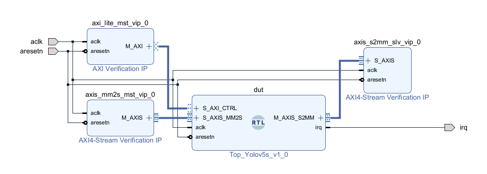

# AXI VIP Verification

## Purpose

Core의 numeric correctness와 AXI wrapper의 protocol correctness는 서로 다른 문제입니다. AXI VIP 단계에서는 NPU 내부 구현을 black box로 두고 control/stream interface의 protocol behavior를 독립적으로 검증했습니다.

  

실제 Vivado AXI VIP 검증 Block Design. AXI4-Lite control, MM2S stream input, S2MM stream output을 DUT 외부에서 독립적으로 구동·관찰합니다.

## Verified interface boundary

- AXI4-Lite control register transaction
- AXI4-Stream MM2S input delivery
- AXI4-Stream S2MM output collection
- Backpressure 중 payload stability
- Packet boundary와 `TKEEP/TLAST`
- interrupt output observation

그림에서 AXI4-Lite master VIP는 control plane을 담당하고, MM2S master VIP는 NPU 입력 stream을 구동하며, S2MM slave VIP는 NPU 출력 stream에 backpressure를 가할 수 있습니다. 따라서 내부 datapath와 AXI protocol behavior를 분리해 검증할 수 있습니다.

## Stress scenarios

| Scenario | 검증 목적 |
|---|---|
| MM2S input gap | 입력이 연속적이지 않아도 내부 상태가 깨지지 않는지 확인 |
| S2MM backpressure | `TREADY=0` 동안 `TDATA/TKEEP/TLAST`가 유지되는지 확인 |
| AXI-Lite channel skew | AW와 W channel이 다른 cycle에 도착해도 write가 정확한지 확인 |
| Output count check | 누락·중복 beat 검출 |
| TLAST check | 마지막 packet 위치 검증 |

검증 실행에서는 input gap 3,729 cycle과 output stall 18,200 cycle을 발생시켰고, 33,600 output beat의 data 및 handshake metadata를 golden과 비교했습니다.

## Why the real Block Design is shown

이 문서에서는 개념적으로 다시 그린 AXI 그림 대신 **실제 검증에 사용한 Vivado Block Design**을 공개 evidence로 사용합니다. DUT 내부 RTL은 공개하지 않지만, 어떤 interface가 어떤 VIP에 연결되어 검증되었는지는 그대로 확인할 수 있습니다.

## Public evidence boundary

공개 가능한 항목:

- AXI VIP Block Design
- `TVALID/TREADY` stall 조건과 protocol acceptance criteria
- output beat count와 `TKEEP/TLAST` 검증 기준
- 최종 PASS/FAIL 요약

공개하지 않는 항목:

- NPU 내부 RTL
- 논문용 detailed architecture
- golden payload 원본
