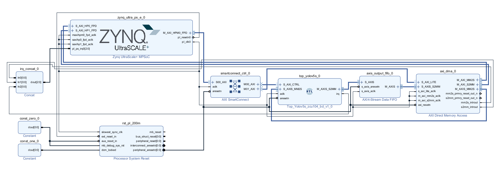
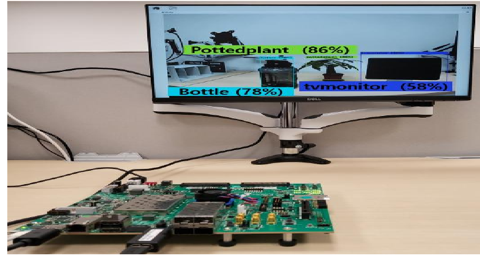

# ZCU104 AXI DMA Integration

## Actual ZCU104 Block Design

<p align="center">
  
</p>
<p align="center"><sub>현재 ZCU104 통합에 사용한 실제 Vivado Block Design. Custom YOLOv5s core는 외부 AXI interface만 보이고 내부 microarchitecture는 공개하지 않습니다.</sub></p>

이 그림은 개념적으로 다시 그린 AXI diagram이 아니라 실제 PS-PL integration 구조를 보여줍니다.

```text
PYNQ / PS software
  ├─ AXI4-Lite → SmartConnect → NPU / DMA control
  ├─ DDR input / parameter buffer
  └─ DDR output buffer
             ↕
          AXI DMA
     MM2S         S2MM
       │           ▲
       ▼           │
  Custom YOLOv5s NPU
       │
       ▼
 AXI4-Stream FIFO
```

## Interface roles

- `M_AXI_HPM0_FPD` 계열은 PS가 PL control register에 접근하는 control path에 사용
- SmartConnect는 AXI4-Lite control access를 NPU와 DMA에 분배
- DMA MM2S는 DDR payload를 AXI4-Stream input으로 변환
- NPU `S_AXIS_MM2S`는 input stream을 수신
- NPU `M_AXIS_S2MM`는 detection output stream을 전송
- AXI4-Stream FIFO는 output side의 decoupling/backpressure boundary를 제공
- DMA S2MM은 output stream을 DDR에 기록
- `irq_concat`는 NPU/DMA interrupt를 PS interrupt input으로 집계
- `proc_sys_reset` 계열 reset은 PL clock domain에 동기화된 reset을 배포

## Integration verification

Core와 AXI VIP에서 확인한 조건을 실제 DMA/SmartConnect/FIFO 통합 환경에서도 유지합니다.

- reset 및 clock domain 연결
- address map과 register access
- DMA length와 NPU expected count 일치
- input completion, layer request와 parameter supply 순서
- output FIFO backpressure
- final TLAST와 DMA completion
- frame 간 상태 초기화 및 buffer ownership
- NPU/DMA interrupt propagation

## Clocking note

Block Design의 instance 이름에 과거 주파수를 암시하는 문자열이 남아 있을 수 있으므로 instance name을 주파수 근거로 사용하지 않습니다. 실제 clock target은 PS `pl_clk0` 설정과 propagated clock metadata, 이후 synthesized/implemented timing report로 검증합니다.

## PYNQ object-detection demo

<p align="center">
  
</p>
<p align="center"><sub>ZCU104 기반 PYNQ object-detection demo evidence. Monitor의 detection overlay와 실제 FPGA board 동작을 함께 보여줍니다.</sub></p>

Source portfolio에서는 다음 board-level integration을 완료했다고 기록합니다.

- ZCU104 PYNQ environment에서 overlay / DMA 기반 accelerator control
- integer reference output과 accelerator output consistency verification
- PS processing과 PL inference overlap
- latest-frame-first policy로 continuous video latency accumulation 억제
- video input → object detection overlay까지 demo 구현
- stage-level latency, inference FPS, display FPS의 분리 측정

## Public benchmark boundary

PYNQ demo가 구현되었다는 사실과 board photo는 공개하지만, 이 repository에는 matching `.bit`/`.hwh`와 측정 log를 포함하지 않습니다.  
따라서 continuous-video FPS 수치를 공개 benchmark처럼 제시하지 않고, accelerator cycle/implementation result와 board application measurement를 분리합니다.
