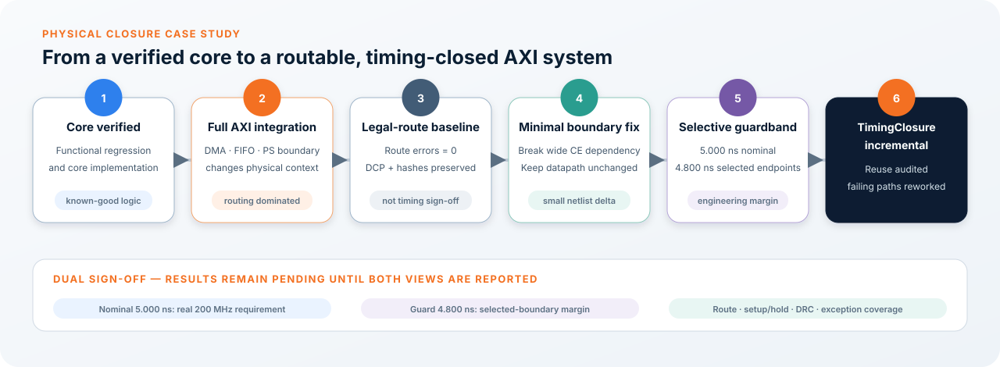

# Physical Design Debugging Case Study

> **Status: timing closure in progress.** 아래 baseline은 routing legality가 확인된 기준점이며 timing-pass 결과가 아닙니다.

<p align="center">
  
</p>

## Problem transition: core to full AXI system

Core 단계의 기능과 구현 가능성을 확인한 뒤 PS, AXI DMA, FIFO와 wrapper를 통합하면 같은 RTL이라도 물리적 조건은 달라집니다. Wider control/data boundary, fixed-column resource 접근과 interconnect가 추가되면서 core-alone 결과를 full-system timing 결과로 그대로 간주할 수 없습니다.

이 사례의 핵심은 “core는 되지만 AXI를 붙이면 안 된다”는 현상을 임의의 strategy 반복으로 해결하는 것이 아니라, 다음 세 문제로 분리한 것입니다.

- Functional/protocol correctness: simulation과 scoreboard로 검증
- Routing legality: failed/unrouted/overlap 0인지 확인
- Timing closure: legal route 위에서 nominal 5.000 ns setup/hold를 확인

## Baseline

ZCU104 full AXI design에서 다음 물리 baseline을 보존했습니다.

| Metric | Baseline |
|---|---:|
| Routing errors | 0 |
| Unrouted nets | 0 |
| Node overlaps | 0 |
| WNS | −0.262 ns |
| TNS | −215.215 ns |
| Failing endpoints | 2,492 |
| Hold slack | +0.001 ns |

이 baseline은 timing pass 결과가 아니라, routing이 정상적으로 완료된 상태에서 timing 원인을 좁히기 위한 물리적 기준입니다.

## Root-cause analysis

Worst path는 software configuration register에서 wide output packer register의 clock-enable로 이어졌습니다.

```text
32-bit output-count configuration
       ↓ validation and modulo logic
ARM decision
       ↓ high-fanout control path
wide output packer clock-enable
```

- Data path delay: 약 5.200 ns
- Logic levels: 16
- Routing delay share: 약 70.8%

## Minimal RTL correction

- ARM qualification을 AXI-Lite control boundary에서 수행
- 승인/거부 결과를 1-cycle pulse로 등록
- 실행 frame의 expected output count를 ARM 시 별도 register에 snapshot
- Output packer가 live configuration register를 직접 참조하지 않도록 분리

Core datapath, PE, feature-memory controller, requantization, DMA width와 Block Design topology는 변경하지 않았습니다.

## Avoiding stale generated netlists

Vivado Block Design의 module reference가 이전 OOC checkpoint를 재사용하면 source를 수정해도 전체 implementation이 100% 동일하게 보일 수 있습니다. 이를 방지하기 위해 다음을 확인했습니다.

1. Module reference update
2. BD target regeneration
3. 해당 OOC synthesis run reset/relaunch
4. 새 OOC netlist에서 수정 register/cell 존재 확인
5. 그 후에만 full-design incremental implementation 실행

## Incremental implementation

Routing 성공 post-route full-design DCP를 reference checkpoint로 사용합니다. 동일한 logic은 기존 placement/routing을 최대한 재사용하고, 변경된 logic과 영향을 받은 주변 경로만 다시 최적화합니다. AMD 공식 문서에서도 재사용된 placement/routing이 QoR 또는 routability 개선을 위해 다시 풀릴 수 있다고 설명하므로, 이 DCP를 hard lock이나 성공 보장으로 표현하지 않습니다.

초기 incremental 후보는 `RuntimeOptimized`로 구성했지만, 공식 directive 의미를 다시 점검하면서 목적 불일치를 발견했습니다. Reference의 WNS가 −0.262 ns이므로 최종 closure 목적에는 `RuntimeOptimized`가 아니라 `TimingClosure`가 맞습니다. AMD UG835 기준으로 전자는 reference WNS를, 후자는 WNS 0을 목표로 합니다. 다음 closure 후보는 이 기준으로 실행하며 결과는 아직 Pending입니다.

DCP 자체는 공개하지 않고 다음 정보만 기록합니다.

- Vivado release와 device part
- DCP hash, source/constraint hash
- Baseline route/timing summary
- Cell/net/placement/routing reuse report
- Candidate와 reference의 worst-path 변화

## Selective wrapper timing guardband

전체 설계의 실제 clock는 5.000 ns, 200 MHz로 유지합니다. Routing-dominated core-to-wrapper/output boundary만 4.800 ns로 요구하여 0.200 ns의 implementation margin을 시도합니다.

이 값은 AMD 또는 AXI 규격이 정한 margin이 아니라 프로젝트별 engineering choice입니다. 선택 경로를 무시하는 것도 아닙니다. 예를 들어 4.900 ns 경로는 nominal 5.000 ns에서는 통과하지만 4.800 ns guard에서는 실패하므로, tool에 더 강한 최적화 우선순위를 부여합니다.

현재 공개 가능한 범위에서는 512-bit output bank와 관련된 일부 control endpoint가 대상입니다. Audit된 selector는 515개 sequential cell과 1,030개의 `D/CE` endpoint를 선택했습니다. Full private hierarchy selector 대신 register-family별 적용 개수와 exception coverage만 공개합니다. 구체적인 의미와 검증 조건은 [Selective Wrapper Timing Guardband](../engineering_notes/009_SELECTIVE_WRAPPER_TIMING_GUARDBAND.md)에 정리했습니다.

## Official flow versus engineering choice

| 항목 | 분류 | 설명 |
|---|---|---|
| Routed DCP incremental reuse | AMD documented | Matching cell/net의 physical data 재사용 |
| `TimingClosure` directive | AMD documented | WNS 0을 목표로 failing path 재최적화 |
| `set_max_delay` | AMD documented | 선택 path의 maximum delay 지정 |
| Wrapper endpoint selection | Project decision | 실제 critical-path evidence로 범위 결정 |
| 0.200 ns guard size | Project decision | AXI requirement가 아닌 국소 margin |
| Modified timing result | Pending | Final routed reports 전에는 성공 주장 금지 |

## Dual sign-off gate

최종 결과는 다음을 모두 충족해야 합니다.

1. `report_route_status`: failed/unrouted/overlap 0
2. Nominal 5.000 ns setup/hold timing pass
3. Guard 4.800 ns 결과를 별도 보고
4. `report_incremental_reuse`로 reference가 실제 적용됐는지 확인
5. `report_exceptions -coverage/-ignored`로 guard 범위 확인
6. `check_timing`에서 unconstrained path 확인
7. DRC/methodology critical violation 0

Guard가 실패하고 nominal만 통과하면 “200 MHz는 만족했지만 0.2 ns 추가 margin은 확보하지 못했다”고 기록합니다. Timing closure가 완료될 때까지 bitstream 또는 board result로 승격하지 않습니다.

## Result table

현재 implementation 완료 후 아래 표를 갱신합니다.

| Metric | Baseline | Modified |
|---|---:|---:|
| Routing errors | 0 | Pending |
| WNS | −0.262 ns | Pending |
| TNS | −215.215 ns | Pending |
| Failing endpoints | 2,492 | Pending |
| LUT | Baseline | Pending |
| FF | Baseline | Pending |

## Official AMD references

- [UG904 — Running Incremental Place and Route](https://docs.amd.com/r/2023.1-English/ug904-vivado-implementation/Running-Incremental-Place-and-Route)
- [UG904 — Using Incremental Implementation](https://docs.amd.com/r/2023.1-English/ug904-vivado-implementation/Using-Incremental-Implementation)
- [UG835 — `read_checkpoint` and directive semantics](https://docs.amd.com/r/2023.1-English/ug835-vivado-tcl-commands/read_checkpoint)
- [UG835 — `set_max_delay`](https://docs.amd.com/r/2023.1-English/ug835-vivado-tcl-commands/set_max_delay)
- [UG903 — Maximum/minimum delay consequences](https://docs.amd.com/r/2023.1-English/ug903-vivado-using-constraints/Consequences-of-Setting-Maximum-Delay-or-Minimum-Delay-Constraints-on-a-Path)
- [UG903 — Path segmentation](https://docs.amd.com/r/2023.1-English/ug903-vivado-using-constraints/Path-Segmentation)
- [UG906 — Router Initial Congestion Reporting](https://docs.amd.com/r/2023.1-English/ug906-vivado-design-analysis/Router-Initial-Congestion-Reporting)

