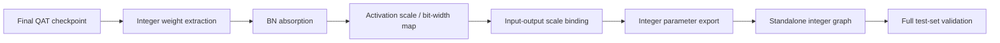

# Integer Export and RTL Reference

[← Software overview](README.md) · [Software–RTL Numeric Contract](../docs/02_SW_RTL_NUMERIC_CONTRACT.md)

## Goal

QAT model이 높은 정확도를 유지하더라도 PyTorch/Brevitas 연산을 그대로 RTL golden으로 사용할 수는 없습니다.

RTL 비교 기준에는 다음 변환이 포함되어야 합니다.

- quantized weight의 integer representation
- BN folding/absorption
- activation scale/bit-width
- integer accumulator
- requantization
- rounding and saturation
- residual add
- concatenation
- SPPF
- multi-scale detection boundary

따라서 최종 checkpoint에서 **integer artifact를 추출한 뒤, source QAT model과 독립적으로 실행되는 reference model**을 구성했습니다.

## Export pipeline



## Export acceptance

parameter export 단계에서는 다음을 자동 검사했습니다.

- quantized weight reconstruction consistency
- scale approximation error
- integer bias conversion
- clipping/saturation condition
- rounding-error bound
- input/output scale source resolution
- multi-source path binding

최종 export audit는 모든 required check를 통과한 artifact만 다음 단계로 전달했습니다.

## Why layer-level error is not enough

초기 RTL-oriented integer approximation은 local layer error 기준에서는 허용 가능한 후보를 만들었지만, full `test2007` inference에서 mAP@0.5:0.95가 약 **5.14%p 감소**했습니다.

이 후보는 바로 reject했습니다.

반면 requant approximation을 제거한 exact-integer replay는 software reference 대비 mAP@0.5:0.95 감소가 약 **0.26%p** 수준이었습니다.  
즉 문제의 원인이 integer convolution 자체보다 **requantization approximation의 누적 오차**에 있다는 것을 분리할 수 있었습니다.

이후 end-to-end accuracy를 기준으로 integer formulation을 수정해 software reference에 근접한 결과를 확보했습니다.

이 사례에서 사용한 기준은 다음과 같습니다.

> Local numeric error가 작아도 end-to-end detection accuracy가 무너지면 RTL parameterization으로 채택하지 않는다.

세부 requantization equation과 parameter width는 공개하지 않습니다.

## Standalone RTL/C-style reference

최종 단계에서는 원본 YOLO/Brevitas module을 forward에서 호출하지 않는 standalone model을 구성했습니다.

이 model은 exported integer artifact와 primitive graph execution으로 다음 연산을 재현합니다.

```text
integer input
    ↓
integer convolution / accumulation
    ↓
integer requantization
    ↓
residual / concat / SPPF
    ↓
integer detection-head boundary
    ↓
PS-side dequantization and decode
```

Save/reload 후 다음을 확인했습니다.

- source model object 없음
- Brevitas object 없음
- input: `1 × 3 × 640 × 640`
- prediction: `1 × 25200 × 25`
- detection grids: `80×80`, `40×40`, `20×20`

## Full fixed-640 comparison

동일한 square 640×640 dataloader에서 reference model과 standalone integer model을 다시 평가했습니다.

| Model | P | R | mAP@0.5 | mAP@0.5:0.95 |
|---|---:|---:|---:|---:|
| Quantized software reference | 81.39% | 75.01% | 80.11% | 55.84% |
| Standalone integer reference | 80.92% | 74.85% | 79.79% | 55.40% |
| Difference | -0.476%p | -0.166%p | -0.322%p | **-0.439%p** |

이 standalone integer reference가 이후 RTL golden generation과 bit-exact regression의 software-side 기준입니다.
