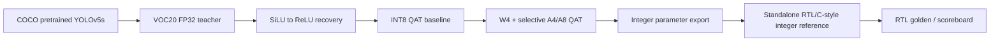

# YOLOv5s Software-to-RTL Pipeline

> 이 문서는 YOLOv5s-derived VOC20 저정밀 가속기의 **software training → quantization → integer reference → RTL verification** 흐름을 공개 가능한 범위에서 정리합니다.

[← YOLOv5s project overview](../README.md) · [Software–RTL Numeric Contract](../docs/02_SW_RTL_NUMERIC_CONTRACT.md) · [Verification Strategy](../docs/03_VERIFICATION_STRATEGY.md)

## Why the software pipeline matters

이 프로젝트에서 software 단계의 목적은 단순히 높은 정확도의 checkpoint를 얻는 것이 아닙니다.  
학습된 모델을 RTL로 옮길 때 필요한 **activation, quantization, scale, rounding, saturation과 graph semantics를 검증 가능한 계약으로 고정하는 것**이 핵심입니다.

따라서 software flow는 다음 네 역할을 동시에 수행합니다.

- VOC20 detection accuracy를 확보하는 floating-point reference 생성
- hardware-friendly activation과 low-bit quantization으로 모델 변환
- quantized model의 scale/bit-width/parameter를 integer domain으로 export
- PyTorch/Brevitas 실행에 의존하지 않는 standalone integer reference를 만들어 RTL golden으로 사용

## End-to-end flow

이 흐름은 모델 정확도와 RTL 구현 가능성을 따로 보지 않습니다.  
한 단계의 결과는 다음 단계에서 **load consistency, bit-width map, integer export, end-to-end accuracy**로 다시 검증됩니다.

## Dataset and evaluation boundary

- Dataset: PASCAL VOC, 20 classes
- Input size: 640×640
- Training split: VOC2007 train + VOC2012 train + VOC2012 val
- Validation split: VOC2007 val
- Final test split: VOC2007 test
- Test set used by the recorded software stages: 4,952 images / 12,032 instances

## Software accuracy checkpoints

| Stage | Precision | Recall | mAP@0.5 | mAP@0.5:0.95 | Role |
|---|---:|---:|---:|---:|---|
| FP32 teacher | 82.74% | 79.45% | 85.53% | 62.18% | accuracy reference |
| ReLU recovery | 82.00% | 77.90% | 83.70% | 60.50% | hardware-friendly activation recovery |
| INT8 QAT | 81.52% | 78.28% | 83.15% | 59.89% | low-risk quantized baseline |
| Final W4 + selective A4/A8 | 82.15% | 74.06% | 80.48% | 55.94% | final low-precision software checkpoint |

위 수치는 모두 `test2007` 평가 결과입니다. 다만 학습 단계별 evaluator 구현과 loader option이 완전히 동일하다고 가정하지 않으므로, 이 표를 모든 단계의 엄밀한 ablation delta로 해석하지 않습니다.

## Same-loader software-to-integer comparison

RTL용 standalone integer reference는 **reference model과 동일한 fixed 640×640 dataloader**에서 다시 평가했습니다.

| Model | P | R | mAP@0.5 | mAP@0.5:0.95 |
|---|---:|---:|---:|---:|
| Quantized software reference | 81.39% | 75.01% | 80.11% | 55.84% |
| Standalone RTL/C-style integer reference | 80.92% | 74.85% | 79.79% | 55.40% |
| Difference | -0.476%p | -0.166%p | -0.322%p | **-0.439%p** |

이 비교에서는 reference와 integer model이 같은 640×640 square loader를 사용하므로, software-to-integer 변환의 end-to-end 영향 범위를 직접 확인할 수 있습니다.

## What was implemented in software

### 1. FP32 teacher and ReLU recovery

COCO pretrained YOLOv5s를 VOC20에 맞게 fine-tuning해 teacher를 만들고, RTL 구현에 불리한 SiLU를 ReLU로 치환했습니다.  
치환 후 teacher weight를 구조가 동일한 ReLU model에 이식하고, missing/unexpected key가 없는지 확인한 뒤 recovery training을 수행했습니다.

→ [Training and ReLU Recovery](01_TRAINING_AND_RELU_RECOVERY.md)

### 2. QAT and mixed precision

Brevitas를 사용해 `Conv2d → QuantConv2d`, `ReLU → QuantReLU` 변환을 수행했습니다.  
먼저 W8/A8 QAT baseline을 안정화한 뒤, 최종 모델에서는 **모든 convolution weight를 W4**로 두고 대부분의 activation을 A4로 낮추되, 입력과 선택된 shared-source activation만 A8로 유지했습니다.

→ [Quantization and Mixed Precision](02_QUANTIZATION_AND_MIXED_PRECISION.md)

### 3. Distillation and checkpoint selection

Low-bit fine-tuning 과정에서 detection loss 외에 box/object-class/feature distillation을 실험할 수 있는 training framework를 구성했습니다.  
중요한 것은 distillation을 사용했다는 사실보다, **validation이 개선되지 않으면 더 오래 학습한 checkpoint를 채택하지 않았다는 점**입니다.

→ [Distillation and Checkpoint Selection](03_DISTILLATION_AND_CHECKPOINT_SELECTION.md)

### 4. Integer export and standalone reference

최종 quantized checkpoint에서 integer weight, activation scale과 integer-domain parameter를 추출하고, residual/concat/SPPF/detection path를 포함하는 standalone reference를 구성했습니다.  
최종 reference는 source YOLO model이나 Brevitas object를 forward에서 호출하지 않고 exported integer artifact만으로 실행됩니다.

→ [Integer Export and RTL Reference](04_INTEGER_EXPORT_AND_RTL_REFERENCE.md)

### 5. Verification and reproducibility

bit-width map, checkpoint load, parameter export, fixed-input shape, detection-grid shape와 full test-set accuracy를 각각 acceptance gate로 사용했습니다.  
local parameter error가 작아도 end-to-end accuracy가 무너지면 해당 변환을 reject했습니다.

→ [Software Verification](05_SOFTWARE_VERIFICATION.md)

## Public disclosure boundary

이 공개 문서는 방법론과 검증 근거를 설명하지만 다음 항목은 포함하지 않습니다.

- 전체 QAT notebook
- trained checkpoint와 weight
- exact quantization parameter payload
- golden vectors
- detailed requantization implementation
- layer-state/scheduling map
- 전체 RTL/testbench

세부 공개 기준은 repository의 [Disclosure Policy](../../DISCLOSURE_POLICY.md)를 따릅니다.
