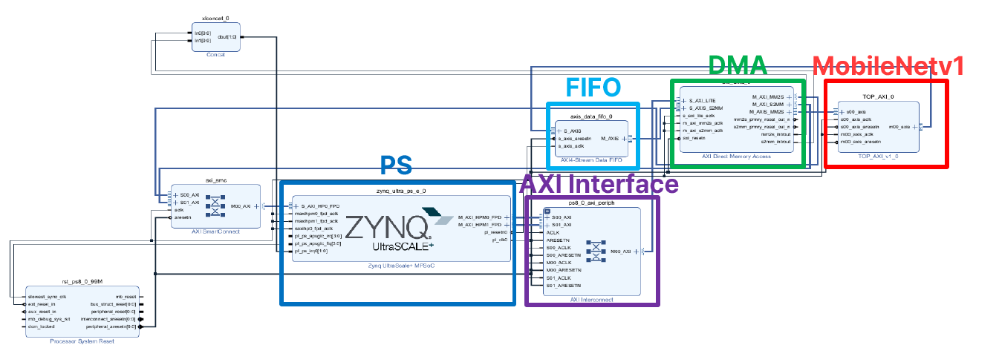
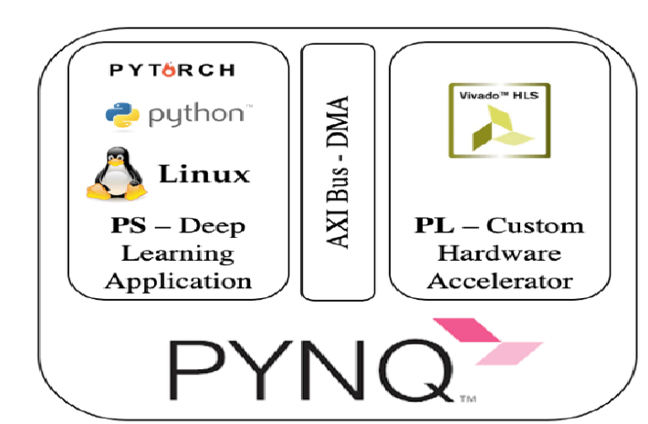

# INT8 MobileNetV1 RTL FPGA Accelerator

> MobileNetV1의 depthwise-separable convolution 특성을 분석해 INT8 QAT, RTL 가속기, ZCU102 SoC 통합과 PYNQ 영상 분류 데모까지 연결한 독립 FPGA case study입니다.

[← Portfolio home](../README.md) · [YOLOv5s case](../02_YOLOV5S_RTL_ACCELERATOR/README.md)

## Project at a glance

| 항목 | 내용 |
|---|---|
| Workload | MobileNetV1, 224×224 image classification |
| Numeric format | Fixed-8 / INT8 QAT |
| Core challenge | Depthwise/pointwise convolution의 연산량·데이터 이동·병렬도 불균형 |
| FPGA / board | Xilinx Zynq UltraScale+ XCZU9EG / ZCU102 |
| Implementation clock | 150 MHz |
| SoC interface | AXI4-Stream, AXI4-Lite, AXI DMA, FIFO |
| Runtime | PYNQ overlay + PS/PL control |
| Demo status | ZCU102 PYNQ 영상 분류 데모 구현 및 검증 완료 |
| Publication status | IEEE TVLSI manuscript submitted; revision in progress |

## Why MobileNetV1 is a different hardware problem

MobileNetV1은 standard convolution을 단순히 줄인 모델이 아니라 depthwise convolution(DWC)과 pointwise convolution(PWC)을 반복합니다.  
이 때문에 layer마다 feature-map/weight 비중과 유효 병렬도가 크게 달라지고, 범용 convolution datapath를 그대로 사용하면 연산기 활용률과 memory efficiency가 동시에 떨어질 수 있습니다.

이 프로젝트에서는 다음 세 문제를 중심으로 설계했습니다.

1. **Resource utilization** — layer별 workload 차이에 맞춰 병렬도와 memory banking을 조정
2. **Energy efficiency** — 반복적인 대용량 memory activation을 줄이고 local reuse 확대
3. **Pipeline throughput** — PWC/DWC 사이의 producer-consumer 대기를 줄여 연속 데이터 공급

논문 투고 전 공개 범위를 지키기 위해 세부 PE topology와 제안 architecture figure는 이 저장소에 포함하지 않습니다.

## Engineering approach

### Layer-adaptive parallelism

layer마다 feature-map과 weight 비중이 달라 고정 parallelism만으로는 자원 활용을 일정하게 유지하기 어렵습니다.  
본 설계에서는 layer 특성에 맞춰 parallelism을 조정하고, banked local memory를 사용해 bandwidth/resource trade-off를 관리했습니다.

Source portfolio에서 확인된 구현 결과:

- PE utilization: **98.64%**
- low-cost LUT-based banking: **2,048 LUT banks**를 활용한 bandwidth 확보

세부 mapping diagram과 paper novelty figure는 공개하지 않습니다.

### Memory hierarchy and reuse

큰 memory와 compute array를 직접 연결해 반복 접근하는 대신, 작은 local/LUTRAM buffer에서 image-plane 데이터를 재사용해 large-memory activation을 줄이는 방향으로 설계했습니다.

공개 가능한 핵심 원칙은 다음과 같습니다.

- local buffering을 통한 data reuse
- BRAM access 빈도 감소
- DWC/PWC 데이터 공급과 연산을 분리해 memory bottleneck 완화

세부 memory hierarchy figure는 manuscript용 자료이므로 공개하지 않습니다.

### Sliding-window pipeline

DWC와 PWC를 순차적으로 처리하면 stage 사이 tail latency가 남습니다.  
본 프로젝트에서는 sliding-window 기반 producer-consumer pipeline을 사용해 다음 stage가 전체 feature map 완료를 기다리지 않고 준비된 window부터 연산을 시작하도록 구성했습니다.

Source portfolio에 기록된 결과:

- **250+ FPS class throughput**
- 비교 기준 대비 energy efficiency **1.35×**
- DSP efficiency **1.57×**

정확한 internal timing diagram은 공개하지 않습니다.

## Implementation result

Source portfolio의 `This Work` implementation 결과:

| Metric | Result |
|---|---:|
| FPGA device | XCZU9EG |
| Clock | 150 MHz |
| Precision | Fixed-8 |
| Input | 224×224 |
| Frame rate | **252.7 FPS** |
| Throughput | **287.6 GOPS** |
| Power | **4.296 W** |
| Power efficiency | **66.9 GOPS/W** |
| HW efficiency | **3.34 GOPS/DSP** |
| DSP | 86 |
| BRAM | 489.5 |
| LUT | 171.3K |
| FF | 100K |

이 수치는 Vivado implementation 기반 accelerator result이며 PYNQ application의 end-to-end UI/display FPS와 동일한 지표로 취급하지 않습니다.

→ [Implementation Results](docs/02_IMPLEMENTATION_RESULTS.md)

## Actual ZCU102 SoC integration evidence

<p align="center">
  
</p>
<p align="center"><sub>실제 MobileNetV1 ZCU102 SoC integration Block Design. 논문용 내부 accelerator architecture가 아니라 AXI/PS–PL system boundary만 공개합니다.</sub></p>

PYNQ 기반 시스템에서는 PS application이 overlay를 로드하고 PL accelerator를 제어하며, AXI DMA를 통해 DDR과 PL 사이의 payload를 전송합니다.

<p align="center">
  
</p>
<p align="center"><sub>PYNQ 기반 PS software - AXI/DMA - PL custom accelerator 통합 구조.</sub></p>

Source portfolio에서는 ZCU102 PYNQ 환경에서 다음 검증을 완료했다고 기록합니다.

- overlay load 및 PL accelerator control
- accelerator output과 reference result 비교
- image input → FPGA inference → classification result output 연결
- classification demo 구현 및 시연

→ [ZCU102 PYNQ Demo](docs/03_ZCU102_PYNQ_DEMO.md)

## Software / RTL connection

MobileNetV1 case에서도 model과 hardware를 분리하지 않고 다음 흐름으로 연결했습니다.

```text
INT8 QAT model
    ↓
software validation
    ↓
RTL accelerator
    ↓
FPGA implementation
    ↓
AXI/DMA SoC integration
    ↓
PYNQ classification demo
```

YOLOv5s case의 mixed-precision integer-reference flow와는 workload와 검증 방식이 다르며, MobileNet 결과를 YOLO 결과에 복사해 일반화하지 않습니다.

## Research output

Source portfolio에 기록된 MobileNet 관련 연구 실적:

- **A Pipelined MobileNet Accelerator With Fine-Grained Coupling for Power and Resource Efficiency**  
  IEEE Transactions on Very Large Scale Integration (VLSI) Systems, submitted 2026-06-12, revision in progress
- **FPGA 기반 Lightweight CNN Depthwise Convolution 가속기 설계**  
  2025 반도체공학회 하계학술대회
- **Layer-Adaptive Line Buffer Architecture for Pipelined MobileNetV1 Acceleration**  
  ICOS 2026

## Documentation

- [Workload and Design Challenges](docs/01_WORKLOAD_AND_DESIGN_CHALLENGES.md)
- [Implementation Results](docs/02_IMPLEMENTATION_RESULTS.md)
- [ZCU102 PYNQ Demo](docs/03_ZCU102_PYNQ_DEMO.md)

## Disclosure boundary

이 저장소에서는 공개 가능한 system-level evidence와 결과만 제공합니다.

**공개**
- workload / design challenge
- implementation result
- ZCU102 Vivado SoC integration screenshot
- PYNQ software/hardware integration evidence
- demo verification scope

**비공개**
- 전체 RTL
- trained checkpoint / QAT payload
- detailed DSC compute architecture
- proposed top-level architecture figure
- network-adaptive parallelism figure
- line-buffer / memory-hierarchy novelty figure
- PWC-DWC pipeline timing figure

즉, source portfolio의 manuscript용 proposed Figures 3-7은 이 public repository에 복사하지 않습니다.
