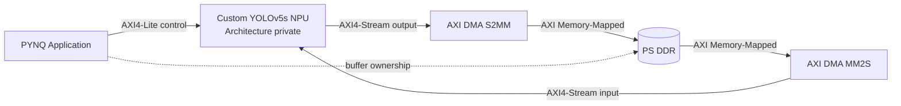

# YOLOv5s 4-bit RTL FPGA Accelerator

> From quantized software reference to bit-exact RTL verification, AXI integration, and ZCU104 physical implementation.

이 저장소는 YOLOv5s 기반 객체검출 가속기를 SystemVerilog RTL로 구현하면서 수행한 설계·검증·SoC 통합 과정을 정리한 공개 기술 포트폴리오입니다. 논문 투고 전 지식재산을 보호하기 위해 전체 RTL과 세부 architecture는 공개하지 않으며, 재현 가능한 검증 방법과 engineering evidence를 중심으로 설명합니다.

## Project at a glance

| 항목 | 내용 |
|---|---|
| Workload | YOLOv5s, 640×640 input, VOC20 target |
| Numeric format | QAT 기반 저정밀 정수 추론, RTL bit-width/rounding/saturation contract |
| Hardware | Parameterized SystemVerilog accelerator |
| Verification | PyTorch integer reference → layer golden → RTL scoreboard |
| SoC interface | AXI4-Lite control, AXI4-Stream input/output, AXI DMA |
| FPGA target | AMD-Xilinx ZCU104 |
| Clock target | 200 MHz |
| Current status | RTL/AXI verification 완료, ZCU104 timing closure 진행 중 |

## Why this project?

YOLOv5s는 convolution만 반복하는 단순 workload가 아닙니다. 서로 다른 feature-map 크기와 channel 수, residual connection, concatenation, upsampling, SPPF, multi-scale detection head가 하나의 graph를 구성합니다. 따라서 RTL 구현에서는 연산기뿐 아니라 memory lifetime, producer-consumer dependency, parameter delivery, backpressure, completion timing을 함께 다뤄야 합니다.

이 프로젝트는 모델 구조를 과도하게 단순화해 구현 난도를 피하기보다, 검증된 모델의 주요 연산 흐름을 유지하고 발생하는 문제를 hardware architecture와 scheduling으로 해결하는 것을 목표로 했습니다.

이 선택은 단순한 구현 편의가 아니라 **기여의 원인을 분리하기 위한 실험 원칙**입니다. Backbone·neck·multi-scale detection의 주요 graph를 유지하면, channel 축소나 layer 제거에서 얻은 성능·자원 이득을 RTL architecture의 효과로 오인하지 않게 됩니다. 반면 dataset class, activation과 quantization 규칙은 VOC20 응용과 RTL 정수 연산 계약에 맞게 명시적으로 변경했습니다. 따라서 이 결과물은 “공식 checkpoint를 그대로 실행한 것”이 아니라 **YOLOv5s-derived VOC20 low-precision RTL accelerator**로 표현합니다.

설계의 차별점은 특정 convolution 블록 하나가 아니라 다음의 연결에 있습니다.

- 복잡한 graph의 compute·data-supply·control 병목을 함께 분석
- 단일 layer를 넘어 인접 producer-consumer/branch 구간을 scheduling 범위로 사용
- 별도 연산기를 계속 추가하지 않고 고정 compute fabric의 역할과 data path를 구간별로 전환
- feature/weight 이동, parameter prefetch와 completion timing을 연산 schedule과 함께 설계
- 전체 network의 integer golden부터 AXI와 physical implementation까지 동일한 acceptance chain으로 검증

이 설계 선택의 정당성과 현재 주장 가능한 범위는 [Model Preservation and Hardware Contribution](docs/01_MODEL_PRESERVATION_AND_HARDWARE_CONTRIBUTION.md)에 정리했습니다.

## Why RTL?

RTL은 저절로 빠르거나 신뢰성이 높은 것이 아닙니다. 대신 병렬도, pipeline stage, memory access, fixed-point arithmetic, handshake와 완료 시점을 cycle 단위로 명시할 수 있습니다. 이 자유도를 올바른 검증과 physical sign-off에 연결하면 다음 특성을 확보할 수 있습니다.

- workload에 맞춘 deterministic datapath와 latency
- 연산·메모리·parameter prefetch의 중첩
- 불필요한 데이터 이동과 toggle의 제어
- backpressure 상황에서도 유지되는 protocol correctness
- software reference부터 FPGA implementation까지 추적 가능한 검증 근거

## Public system boundary

세부 NPU architecture는 공개하지 않고 외부 interface와 검증 경계만 설명합니다.

## Three reading paths

### 30 seconds — What was built?

저정밀 YOLOv5s를 대상으로 software reference, parameterized RTL, full-layer scoreboard, AXI VIP stress, ZCU104 DMA integration과 physical implementation을 하나의 검증 흐름으로 연결했습니다.

### 3 minutes — Is there evidence?

[Verification Strategy](docs/03_VERIFICATION_STRATEGY.md)에서 golden chain과 mismatch 기준을, [AXI VIP Verification](docs/04_AXI_VIP_VERIFICATION.md)에서 input gap·backpressure·packet 검증을, [Physical Design Debugging](docs/06_PHYSICAL_DESIGN_DEBUGGING.md)에서 route/timing 문제를 확인할 수 있습니다.

### Deep dive — Does the author understand the details?

[Engineering Notes](engineering_notes/README.md)는 AXI handshake, DMA, BRAM/URAM, OOC synthesis, incremental DCP와 congestion 분석을 실제 설계에서 얻은 원칙 중심으로 정리합니다.

## Verification evidence

- QAT 모델과 RTL의 bit-width, rounding, saturation 규칙을 명시적으로 연결
- VOC 입력 10종으로 full-layer regression 수행
- 이미지당 세 detection head의 raw output 100,800개 비교에서 mismatch 0 확인
- AXI 출력 33,600 beat에 대해 data, `TVALID`, `TREADY`, `TKEEP`, `TLAST` 검사
- input gap 3,729 cycle과 output backpressure 18,200 cycle을 포함한 stress test
- layer별 expected/actual count와 PASS/FAIL을 자동 집계하는 scoreboard 구성

자세한 내용은 [Verification Strategy](docs/03_VERIFICATION_STRATEGY.md)와 [AXI VIP Verification](docs/04_AXI_VIP_VERIFICATION.md)을 참고하십시오.

## Engineering case study: timing closure

ZCU104 full AXI design에서 routing은 성공했지만 WNS가 −0.262 ns인 물리 baseline을 확보했습니다. 최악 경로는 32-bit ARM configuration 검사와 나머지 연산이 넓은 output packer의 clock-enable까지 연결된 control path였습니다.

전체 architecture를 무작정 변경하지 않고 다음 순서로 접근했습니다.

1. Routing 성공 post-route DCP와 source hash 보존
2. Worst path의 logic/routing delay와 fanout 분석
3. ARM qualification을 AXI-Lite 경계에서 1-bit pulse로 등록
4. Frame별 expected output count를 ARM 시 snapshot
5. Module-reference OOC netlist가 실제로 재생성됐는지 cell 단위 확인
6. 저장한 full-design DCP 기반 incremental implementation

현재 수정 결과는 구현 진행 중이며, timing이 확정되기 전에는 성공 수치로 표시하지 않습니다. 자세한 내용은 [Physical Design Debugging](docs/06_PHYSICAL_DESIGN_DEBUGGING.md)에 기록합니다.

## Documentation

- [Introduction](docs/00_INTRODUCTION.md)
- [Project Scope](docs/01_PROJECT_SCOPE.md)
- [Model Preservation and Hardware Contribution](docs/01_MODEL_PRESERVATION_AND_HARDWARE_CONTRIBUTION.md)
- [Software–RTL Numeric Contract](docs/02_SW_RTL_NUMERIC_CONTRACT.md)
- [Verification Strategy](docs/03_VERIFICATION_STRATEGY.md)
- [AXI VIP Verification](docs/04_AXI_VIP_VERIFICATION.md)
- [ZCU104 AXI DMA Integration](docs/05_ZCU104_DMA_INTEGRATION.md)
- [Physical Design Debugging](docs/06_PHYSICAL_DESIGN_DEBUGGING.md)
- [Results and Limitations](docs/07_RESULTS_AND_LIMITATIONS.md)
- [Engineering Notes](engineering_notes/README.md)
- [Disclosure Policy](DISCLOSURE_POLICY.md)

## Repository scope

이 저장소는 portfolio case study입니다. 전체 RTL, trained weights, parameter payload, golden vector, Vivado generated products와 논문용 상세 architecture는 포함하지 않습니다. 공개 자료의 재사용 조건은 [LICENSE.md](LICENSE.md)를 확인하십시오.
