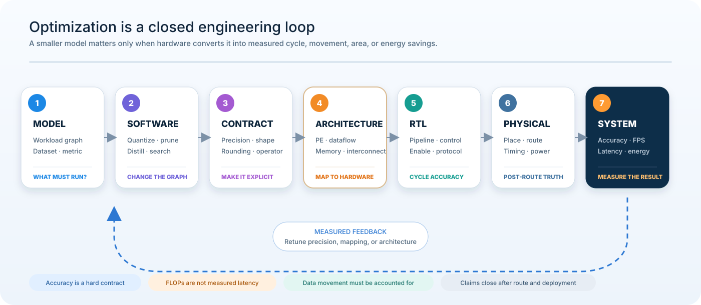

# AI Accelerator RTL Engineering Portfolio

> **두 개의 AI 가속기를 직접 설계하고, FPGA 구현과 PYNQ 데모까지 연결한 RTL/FPGA 포트폴리오**

이 포트폴리오는 “AI 모델을 FPGA에서 돌렸다”는 결과보다, **모델을 실제 디지털 하드웨어 시스템으로 바꾸는 과정**을 보여줍니다.  
제가 직접 수행한 범위는 **저정밀 모델 설계 → SystemVerilog RTL → 자동 검증 → AXI/DMA SoC 통합 → FPGA 배치·배선 → PYNQ 데모**입니다.

<p align="center">
  
</p>

## 30초 요약

| 질문 | 답변 |
|---|---|
| 무엇을 만들었나? | MobileNetV1 영상분류 가속기와 YOLOv5s 객체검출 가속기 |
| 어디까지 구현했나? | RTL 설계, FPGA implementation, AXI/DMA 기반 Zynq SoC 통합, PYNQ demo |
| 핵심 강점은? | 모델 구조와 데이터 흐름을 분석해 **연산기·메모리·제어를 함께 설계**하고, 실제 FPGA 결과로 검증 |
| 어떻게 정확성을 확인했나? | software reference와 RTL 출력을 자동 비교하고, AXI backpressure까지 별도 검증 |
| 회사에서 바로 연결되는 역량은? | Digital HW/FPGA RTL, AI accelerator architecture, AXI SoC integration, timing/congestion debugging |

## 두 프로젝트 한눈에 보기

| | MobileNetV1 | YOLOv5s |
|---|---|---|
| 응용 | 영상 분류 | 객체 검출 |
| 설계 목표 | 경량 CNN을 높은 전성비로 가속 | 복잡한 detector graph를 실시간으로 가속 |
| 핵심 문제 | DWC/PWC의 낮은 활용률과 memory bottleneck | 분기·concat·다중 head로 인한 연산 대기와 data movement |
| 설계 접근 | layer별 병렬도, local reuse, sliding-window pipeline | dependency-aware shared PE, on-chip feature lifetime, full-network scheduling |
| FPGA | ZCU102 / XCZU9EG | ZCU104 |
| 시스템 | AXI4-Lite/Stream · DMA · FIFO · PYNQ | AXI4-Lite/Stream · DMA · SmartConnect · FIFO · PYNQ |
| Demo | PYNQ classification | PYNQ object detection |

> **QAT**는 Quantization-Aware Training, **RTL**은 cycle 단위 hardware behavior를 정의하는 Register-Transfer Level 설계, **DMA**는 DDR과 PL accelerator 사이의 대용량 데이터 전송을 담당합니다.

## 핵심 결과

### 02 · MobileNetV1 RTL Accelerator

- PE utilization **98.64%**
- **252.7 FPS**
- **287.6 GOPS**
- **66.9 GOPS/W**
- **3.34 GOPS/DSP**
- ZCU102 PYNQ classification demo 구현

→ [MobileNetV1 상세 보기](03_MOBILENET_RTL_ACCELERATOR/README.md)

### 03 · YOLOv5s RTL Accelerator

- Full-network PE utilization **90.8%**
- RTL numeric model: mAP@0.5 **79.79%**, mAP@0.5:0.95 **55.40%**
- VOC 10개 입력, 이미지당 raw output 100,800개 비교에서 **mismatch 0**
- AXI stress: 33,600 beats, input gap 3,729 cycles, output stall 18,200 cycles
- ZCU104 implementation: LUT 157.3K · FF 170.3K · BRAM 244 · URAM 64 · DSP 1,152
- ZCU104 PYNQ object-detection demo 구현

→ [YOLOv5s 상세 보기](02_YOLOV5S_RTL_ACCELERATOR/README.md)

## 실제 시스템 구현

<table>
<tr>
<td align="center" width="50%"><b>MobileNetV1 · ZCU102</b></td>
<td align="center" width="50%"><b>YOLOv5s · ZCU104</b></td>
</tr>
<tr>
<td align="center"></td>
<td align="center"></td>
</tr>
<tr>
<td align="center"><sub>Python/PYNQ → AXI DMA → PL accelerator</sub></td>
<td align="center"><sub>실제 ZCU104 board + detection monitor</sub></td>
</tr>
</table>

실제 Vivado Block Design과 AXI VIP 검증 환경도 각 프로젝트 문서에서 확인할 수 있습니다.  
논문 투고 전 보호가 필요한 내부 PE 구조와 novelty diagram은 공개하지 않았습니다.

## 이 포트폴리오에서 확인할 수 있는 역량

### 1. AI model → RTL 변환

저정밀 모델의 bit width, scale, rounding, saturation을 hardware rule로 고정하고 software reference와 RTL이 같은 계산을 수행하도록 연결했습니다.

### 2. SystemVerilog 기반 accelerator 설계

연산기만 만드는 것이 아니라 **memory controller, dataflow, layer dependency, pipeline, completion timing**을 함께 설계했습니다.

### 3. 자동화된 기능 검증

파형을 눈으로만 확인하지 않고 expected count와 data mismatch를 자동 비교했습니다.  
YOLOv5s는 full-network regression에서 공개 가능한 테스트 입력 기준 **mismatch 0**을 확인했습니다.

### 4. AXI / Zynq SoC 통합

AXI4-Lite control, AXI4-Stream data, DMA, FIFO, SmartConnect와 PYNQ를 이용해 PS–PL system을 구성했습니다.

### 5. FPGA physical implementation

Vivado synthesis 숫자만 보는 것이 아니라 placement, routing, timing, fanout, congestion과 resource utilization을 분석해 RTL을 개선했습니다.

## 설계 방법론

<p align="center">
  
</p>

두 프로젝트의 workload는 다르지만 동일한 순서로 문제를 해결했습니다.

```text
Model / QAT
    ↓
Numeric contract
    ↓
RTL architecture
    ↓
Functional verification
    ↓
AXI / SoC integration
    ↓
Place & Route
    ↓
Board demo / measured evidence
```

## 더 자세히 보기

1. [MobileNetV1 RTL Accelerator](03_MOBILENET_RTL_ACCELERATOR/README.md)
2. [YOLOv5s RTL Accelerator](02_YOLOV5S_RTL_ACCELERATOR/README.md)
3. [YOLO Software–RTL Numeric Contract](02_YOLOV5S_RTL_ACCELERATOR/docs/02_SW_RTL_NUMERIC_CONTRACT.md)
4. [Verification Strategy](02_YOLOV5S_RTL_ACCELERATOR/docs/03_VERIFICATION_STRATEGY.md)
5. [AXI VIP Verification](02_YOLOV5S_RTL_ACCELERATOR/docs/04_AXI_VIP_VERIFICATION.md)
6. [Physical Design Debugging](02_YOLOV5S_RTL_ACCELERATOR/docs/06_PHYSICAL_DESIGN_DEBUGGING.md)
7. [Engineering Notes](02_YOLOV5S_RTL_ACCELERATOR/engineering_notes/README.md)

## Result boundary

수치의 의미를 섞지 않습니다.

- accelerator cycle 기반 FPS ≠ camera-to-display FPS
- Vivado power estimate ≠ board 실측 power
- legal route ≠ timing closure
- PYNQ demo 구현 ≠ 공개 가능한 numeric continuous-video benchmark

따라서 아직 공개 증거가 없는 값은 예상치로 채우지 않습니다.

## Disclosure

전체 RTL, trained weights, parameter payload, golden vector, 상세 PE/memory architecture, 논문용 novelty figure, Vivado generated products와 bitstream은 공개하지 않습니다.  
공개 범위는 [Disclosure Policy](DISCLOSURE_POLICY.md)를 따릅니다.
