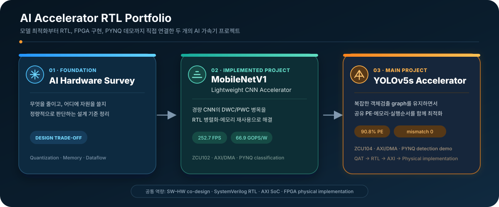

# AI Hardware RTL Engineering Portfolio

> Algorithm optimization, RTL architecture, verification, SoC integration, and physical closure viewed as one engineering chain.

이 저장소는 AI workload를 실제 하드웨어로 구현할 때 필요한 기술을 세 개의 축으로 정리한 포트폴리오입니다. 첫 번째 축은 AI hardware optimization의 넓은 기술 지도를, 두 번째 축은 YOLOv5s-derived detector의 software-to-FPGA end-to-end 사례를, 세 번째 축은 추후 정리할 MobileNet RTL 사례를 담당합니다.

## Portfolio map

| 영역 | 역할 | 현재 상태 |
|---|---|---|
| [01 · AI Hardware Survey](01_AI_HARDWARE_SURVEY/README.md) | Quantization, pruning, dataflow, memory, power와 physical design의 관계 정리 | 1차 기술 지도 완료 |
| [02 · YOLOv5s RTL Accelerator](02_YOLOV5S_RTL_ACCELERATOR/README.md) | Software model부터 RTL, AXI, ZCU104 bitstream/PYNQ까지의 실제 사례 | RTL/AXI 검증 완료, physical closure·board demo 진행 중 |
| [03 · MobileNet RTL Accelerator](03_MOBILENET_RTL_ACCELERATOR/README.md) | 경량 CNN workload에 대한 두 번째 독립 사례 | 자료 정리 전 placeholder |

  

## How to read this repository

- AI 가속기 기법을 전체적으로 보고 싶다면 [Survey](01_AI_HARDWARE_SURVEY/README.md)부터 읽습니다.
- 실제로 하나의 복잡한 모델을 RTL과 SoC까지 어떻게 닫았는지 보려면 [YOLOv5s project](02_YOLOV5S_RTL_ACCELERATOR/README.md)로 이동합니다.
- RTL 설계자의 세부 판단은 YOLO 프로젝트의 [Engineering Notes](02_YOLOV5S_RTL_ACCELERATOR/engineering_notes/README.md)에 있습니다.

## Featured engineering case

Core 단계에서는 구현 가능한 설계가 full AXI/DMA system으로 확장된 뒤 routing-dominated timing 문제를 보였습니다. 이를 legal-route DCP, 최소 boundary RTL 수정, 선택적 timing guardband와 nominal/guard 이중 sign-off로 다루는 과정은 [Physical Design Debugging Case Study](02_YOLOV5S_RTL_ACCELERATOR/docs/06_PHYSICAL_DESIGN_DEBUGGING.md)에 정리했습니다.

현재 결과는 **timing closure in progress**입니다. 완료되지 않은 수치를 성과로 포장하지 않고, AMD 공식 incremental implementation과 XDC 문서를 근거로 문제 정의·실험 조건·판정 기준을 공개합니다.

## Engineering position

이 포트폴리오는 특정 기법을 무조건 우수하다고 설명하지 않습니다. 같은 optimization이라도 hardware가 이를 실제로 이용할 수 있어야 latency, energy 또는 area 개선으로 이어집니다. 따라서 모든 선택을 다음 기준으로 봅니다.

> **Acceptance chain:** accuracy contract → useful hardware work and data movement → cycle/protocol correctness → post-route PPA and deployment evidence

전체 production RTL, trained weights, parameter payload, golden vector, 논문용 상세 architecture와 generated bitstream은 공개하지 않습니다. 공개 범위는 [Disclosure Policy](DISCLOSURE_POLICY.md)를 따릅니다.
